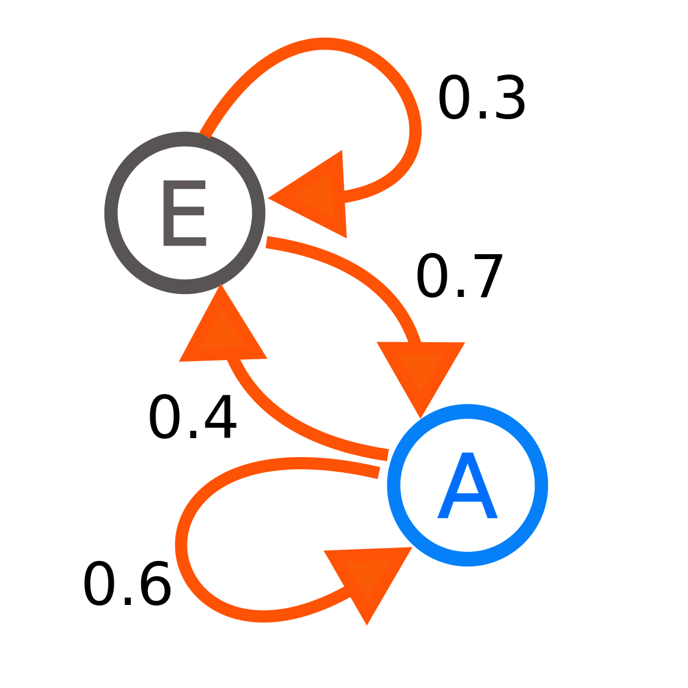
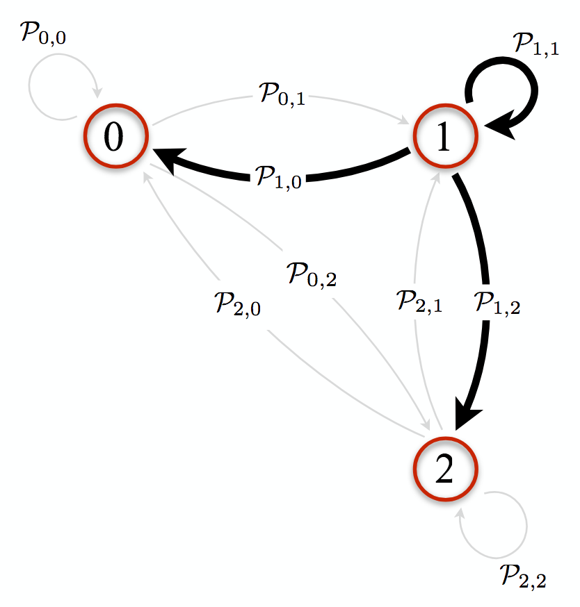
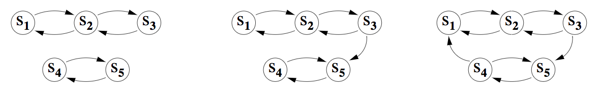

# Contents

[TOC]

# Continuous probability

## Continuous random variables

**==Random variables==** were previously defined in the discrete probability notes as:

> A **random variable** is a function that maps each outcome of the sample space to some numerical value.
>
> Given a sample space $\Omega$, a random variable $X$ with values in some set $\cal{R}$ is a function:
> $$
> \newcommand{\p}[1]{\mathbb{P}\left(#1\right)}
> \newcommand{\cp}[2]{\p{#1\middle|#2}}
> \newcommand{\jp}[2]{\p{#1,#2}}
> \newcommand{\e}[1]{\mathbb{E}\left[#1\right]}
> \newcommand{\var}[1]{\text{Var}\left[#1\right]}
> \newcommand{\sd}[1]{\text{SD}\left(#1\right)}
> \newcommand{\cov}[2]{\text{Cov}\left[#1,#2\right]}
> \newcommand{\img}[1]{\text{Image}\left(#1\right)}
> \newcommand{\bb}{\mathbb}
> \newcommand{\R}{\bb{R}}
> \newcommand{\N}{\bb{N}}
> \newcommand{\Z}{\bb{Z}}
> \newcommand{\Q}{\bb{Q}}
> \newcommand{\C}{\bb{C}}
> \newcommand{\ds}{\displaystyle}
> \newcommand{\set}[1]{\left\lbrace#1\right\rbrace}
> \newcommand{\setb}[2]{\left\lbrace#1\ \middle| \ #2\right\rbrace}
> \newcommand{\d}[1]{\mathrm{d}#1}
> \newcommand{\i}[4]{\int_{#1}^{#2}#3\ \d{#4}}
> \newcommand{\deriv}[2]{\frac{\d{#1}}{\d{#2}}}
> \newcommand{\pderiv}[2]{\frac{\partial #1}{\partial #2}}
> \newcommand{\tp}[1]{\mathcal{P}_{#1}}
> \newcommand{\surp}[1]{\mathcal{S}\left(#1\right)}
> X:\Omega\mapsto\cal{R}
> $$
>

Where $\cal{R}$ was typically $\N$ or $\N_0$ for discrete RVs.

However in continuous probability, the codomain $\cal{R}$ is always $\R$. 

Therefore, a **==continuous random variable==** is a random variable which can take on infinitely many values (has an uncountably infinite range).

---

Given a sample space $\Omega$, a **continuous random variable** $X$ is a function:
$$
X:\Omega\mapsto\R
$$

 ### Examples

> - The continuous random variable $X_1$ could be the length of a randomly selected telephone call in seconds.
> - The continuous random variable $X_2$ could be the volume of water in a bucket.

**Note**: Random variables can be partly continuous and partly discrete!

## Probability density function

###Why can't we use the PMF anymore?

A continuous random variable $X$ has what could be thought of as *infinite precision*.

More specifically, a continuous random variable can realise an infinite amount of real number values within its range, as there are an infinite amount of points in a line segment.

So we have an infinite amount of values whose sum of probabilities must equal one.  This means that these probabilities must each be **infinitesimal**. and therefore:
$$
\p{X=x}=0\qquad\forall x\in\R
$$
It is clear from this result that the **probability mass function** which we previously used in discrete probability will no longer provide any useful information.

### Definition

A **==probability density function==** is a function whose integral over an interval gives the probability that the value of a random variable falls within the interval.

$X:\Omega\mapsto\R$ is a continuous random variable if there is a function $f_X(x)$ such that:
$$
\p{a\leq X\leq b}=\i{a}{b}{f_X(x)}{x}\qquad\forall a,b:-\infty\leq a\leq b\leq\infty
$$
The function $f_X(x)$ is called the **==probability density function==** (**PDF**).

---

For better reasoning as to why $\p{X=x}=0\quad\forall x\in\R$, we can now use the definition above.
$$
\begin{align}
\p{X=a}&=\p{a\leq X\leq a}\\&=\i{a}{a}{f_X(x)}{x}\\&=0
\end{align}
$$

### Properties

The following properties follow from the axioms:

- $\i{-\infty}{\infty}{f_X(x)}{x}=1$
- $f_X(x)\geq0$

## Cumulative distribution function

Sometimes also called **cumulative density function** (to differentiate with between cumulative distribution of a discrete random variable), the **==cumulative distribution function==** of a continuous random variable $X$ evaluated at $x$ is the probability that $X$ will take a value less than or equal to $x$.

The cumulative distribution function is denoted $F_X(x)$, and defined as:
$$
F_X(x)=\i{-\infty}{x}{f_X(u)}{u}
$$
Additionally, if $f_X(x)$ is continuous at $x$:
$$
f_X(x)=\deriv{}{x}F_X(x)
$$

---

The definition of the probability density function given earlier can be expressed in terms of the cumulative distribution function, by the **fundamental theorem of calculus**:
$$
\p{a\leq X\leq b}=\i{a}{b}{f_X(x)}{x}=F_X(b)-F_X(a)\qquad\forall a,b:-\infty\leq a\leq b\leq\infty
$$

### Properties

- The cumulative distribution function is an increasing function.
- $F_X(\infty):=\ds\lim_{x\to\infty}\p{X\leq x}=1$
- $F_X(-\infty):=\ds\lim_{x\to-\infty}\p{X\leq x}=0$

### Example

> Suppose the lifetime $X$ of a car battery has a probability $\p{X>x}=2^{-x}$ of lasting more than $x$ days. Find the probability density function of $X$.
>
> We are given the **complementary cumulative distribution function**:
> $$
> \overline{F_X}(x)=\p{X>x}=2^{-x}
> $$
> And we can determine the cumulative distribution function:
> $$
> \begin{align}
> F_X(x)&=1-\overline{F_X}(x)\\
> &=1-2^{-x}\\
> f_X(x)&=\deriv{}{x}F_X(x)\\
> &=\deriv{}{x}\left(1-2^{-x}\right)\\
> &=2^{-x}\ln2
> \end{align}
> $$
>

## Expectation

If a continuous random variable $X$ is given, and its distribution is given by a probability density function $f_X$, then the expected value of $X$ (if the expected value exists) can be calculated as:
$$
\e{X}=\i{-\infty}{\infty}{x\cdot f_X(x)}{x}
$$

### Moments

The $n$-th moment of a continuous random variable $X\in\R$ is given by:
$$
\e{X^n}=\i{-\infty}{\infty}{x^n\cdot f_X(x)}{x}
$$

### Properties

In general, the properties of expectation for continuous random variables are the same as that of discrete random variables, but switching sums with integrals:

- **Linearity** — for a set of tuples $\set{(X_i,c_i)}_{i=1}^n$, each consisting of a continuous random variable $X_i:\Omega\mapsto\R$ and a corresponding constant $c_i\in\R$:
  $$
  \e{\sum_{i=1}^nc_iX_i}=\sum_{i=1}^nc_i\underbrace{\i{-\infty}{\infty}{x\cdot f_{X_i}(x)}{x}}_{\e{X_i}}\\
  $$

- In general, if $g(X)$ is a function of $X$ (e.g. $X^2$, $\ln(X)$), then $g(X)$ is also a random variable. 

  If $g(X)\in\R$, its expectation is given by:
  $$
  \e{g(X)}=\i{-\infty}{\infty}{g(x)\cdot f_X(x)}{x}
  $$

- *Plus the rest of the properties from discrete random variable expectations*

## Variance

If the random variable $X$ represents samples generated by a continuous distribution with probability density function $f_X$, then the population variance is given by:
$$
\begin{align}
	\var{X}&=\e{\left(X-\e{X}\right)^2}\\
	&\ \text{If we let $\mu=\e{X}=\i{-\infty}{\infty}{x\cdot f_X(x)}{x}$:}\\
	&=\i{-\infty}{\infty}{(x-\mu)^2\cdot f_X(x)}{x}\\
	&=\i{-\infty}{\infty}{x^2\cdot f_X(x)}{x}-2\mu\i{-\infty}{\infty}{x\cdot f_X(x)}{x}+\i{-\infty}{\infty}{\mu^2\cdot f_X(x)}{x}\\
	&=\i{-\infty}{\infty}{x^2\cdot f_X(x)}{x}-\mu^2\\
	&=\e{X^2}-\e{X}^2\\
\end{align}
$$
All properties from the variance of discrete random variables still hold for continuous random variables.

## Distributions

### Uniform distribution

The **==uniform distribution==** with parameters $a,b\in\R:-\infty<a<b<\infty$ is a distribution where all intervals of the same length on the distribution's support $[a,b]$, for a random variable $X:\Omega\mapsto[a,b]\subset\R$ are equally probable. 

The support is defined by the two parameters $a$ and $b$.

The probability density function for a uniformly distributed random variable $X:\Omega\mapsto[a,b]\subset\R$ would be:
$$
f_X(x:a,b)=
\begin{cases}
	\frac{1}{b-a},\quad&a<x<b\\
	0,&\text{otherwise}
\end{cases}
$$

Additionally, the cumulative distribution function is given by:
$$
F_X(x:a,b)=
\begin{cases}
	0,\quad&x<a\\
	\frac{x-a}{b-a},&a\leq x\leq b\\
	1,&x>b
\end{cases}
$$

| Parameter        | Meaning       |
| ---------------- | ------------- |
| $a\in\R : a < b$ | Minimum value |
| $b\in\R:b>a$     | Maximum value |

| Quantity (or function)     | Formula                                |
| -------------------------- | -------------------------------------- |
| Mean (expected value)      | $\e{X}=\dfrac{a+b}{2}$                 |
| Variance                   | $\var{X}=\dfrac{(b-a)^2}{12}$          |
| Moment-generating function | $M_X(t)=\dfrac{e^{tb}-e^{ta}}{t(b-a)}$ |

### Exponential distribution

The **==exponential distribution==** is the probability distribution that describes the time between events in a process in which events occur continuously and independently at a **constant average rate**.

An exponentially distributed random variable $X:\Omega\mapsto\R$ with rate parameter $\lambda\in\R:\lambda>0$ has the probability density function:
$$
f_X(x:\lambda)=
\begin{cases}
	\lambda e^{-\lambda x},\quad &x\geq0\\
	0,&x<0
\end{cases}
$$
Additionally, the cumulative distribution function is given by:
$$
F_X(x:\lambda)=
\begin{cases}
	1-e^{-\lambda x},\quad&x\geq0\\
	0,& x<0
\end{cases}
$$

| Parameter                | Meaning               |
| ------------------------ | --------------------- |
| $\lambda\in\R:\lambda>0$ | Constant average rate |

| Quantity (or function)     | Formula                             |
| -------------------------- | ----------------------------------- |
| Mean (expected value)      | $\e{X}=\dfrac{1}{\lambda}$          |
| Variance                   | $\var{X}=\dfrac{1}{\lambda^2}$      |
| Moment-generating function | $M_x(t)=\dfrac{\lambda}{\lambda-t}$ |

### Gaussian distribution

To denote a random variable $X:\Omega\mapsto\R$ which is distributed according to the **==Gaussian distribution==**, we write $X\sim\cal{N}(\mu,\sigma^2)$, with standard deviation $\sigma$, variance $\sigma^2$ and mean/expectation $\mu$.

The probability density function for a Gaussian distributed random variable $X:\Omega\mapsto\R$ would be:
$$
f_X(x:\mu,\sigma^2)=\frac{1}{\sqrt{2\pi\sigma^2}}e^{\frac{(x-\mu)^2}{2\sigma^2}}\quad\text{where $x\in\R$}
$$

Additionally, the cumulative distribution function is given by the integral:
$$
F(x)=\Phi\left(\frac{x-\mu}{\sigma}\right)=\frac{1}{2}\left[1+\mathrm{erf}\left(\frac{x-\mu}{\sigma\sqrt2}\right)\right]
$$
**Note**: We must use an evaluation table to determine the CDF evaluated at $x$, since $\mathrm{erf}$ is not an elementary function.

| Parameter                  | Meaning                                                      |
| -------------------------- | ------------------------------------------------------------ |
| $\mu\in\R$                 | Mean/expectation of the distribution (also its median and mode) |
| $\sigma^2\in\R:\sigma^2>0$ | Variance                                                     |

| Quantity (or function)     | Formula                                   |
| -------------------------- | ----------------------------------------- |
| Mean (expected value)      | $\e{X}=\mu$                               |
| Variance                   | $\var{X}=\sigma^2$                        |
| Moment-generating function | $M_X(t)=e^{\mu t+\frac{1}{2}\sigma^2t^2}$ |

#### Standard normal distribution

The **==standard normal distribution==** (sometimes **normal distribution**, though this is ambiguous naming) is a special case of the **Gaussian distribution**, when $\mu=0$ and $\sigma^2=1$.

To denote a random variable $X:\Omega\mapsto\R$ which is (standard) normally distributed, we write $X\sim\mathcal{N}(0,1)$.
$$
f_X(x)=\frac{1}{\sqrt{2\pi}}e^{-\frac{1}{2}x^2}
$$
Additionally, the cumulative distribution function is given by the integral:
$$
F(x)=\Phi(x)=\dfrac{1}{\sqrt{2\pi}}\i{-\infty}{x}{e^{-\frac{t^2}{2}}}{x}
$$
**Note**: This integral doesn't evaluate to any simple expression as it cannot be expressed in terms of elementary functions, and instead relies on the special $\mathrm{erf}$ function. Instead, we must use an evaluation table - specifically Table 5.1 in Section 5.4.

### Approximations of the binomial distribution

Recall that the binomial distribution is a discrete probability distribution representing the number of successes in a sequence of $n$ independent experiments, with each experiment being a Bernoulli trial (success/failure experiment) with probability of success $p$.

For a binomially distributed random variable $X_{n,p}$, the probability mass function is given by:
$$
f_{X_{n,p}}(x)=\binom{n}{k}p^k(1-p)^{n-k}\qquad \text{where }k\in\N_0:k\leq n
$$

> Where $X_{n,p}$ is the number of successes in $n$ trials.

#### Poisson approximation

Recall that for a Poisson distributed random variable $X_\lambda$, the probability mass function is given by:
$$
f_{X_{\lambda}}(x)=\frac{\lambda^k}{k!}e^{-\lambda}\qquad\text{where }k\in\N_0
$$

> Where $X_\lambda$ is the number of successes if they occur at rate $\lambda$.

We can approximate the binomially distribution with the Poisson distribution reasonably well when $n\to\infty$ and $p$ is small (with $np<10$). This is true because $\lim_{n\to\infty}f_{X_{n,p}}(x)=f_{X_{\lambda}}$ when $\lambda=np$ — that is:
$$
\lim_{n\to\infty}\binom{n}{k}p^k(1-p)^{n-k}=\frac{\lambda^ke^{-\lambda}}{k!}\qquad\text{where $\lambda=np$ and $k\in\N_0$}
$$
[Click here for more details on this approximation.][poisson-to-binomial]

#### Gaussian/normal approximation

Note that a binomially distributed random variable such as $X_{n,p}$ can be expressed as a sum of $n$ **Bernoulli random variables** — that is:
$$
X_{n,p}=\sum_{i=1}^nY_i\quad\text{where }Y_i=\begin{cases}
	1\quad&\text{if the $i$-th trial is a success}\\
	0\quad&\text{if the $j$-th trial is a failure}
\end{cases}
$$
Additionally, note that:

- $\e{Y_i}=p$ and $\var{Y_i}=p(1-p)$

- $\e{X_{n,p}}=np$ and $\var{X_{n,p}}=np(1-p)$

We then have $\sd{X_{n,p}}=\sqrt{np(1-p)}$.

---

> **This section may not be examinable, but is useful for deriving the Gaussian approximation**

A **==standard score==** (denoted $Z$) is the number of standard deviations by which a data point is above or below the mean value of what is being observed or measured. 

To standardise a data point $x$, we can use the normal standardisation formula:
$$
z=\frac{x-\mu}{\sigma}
$$

---

If we use the normal standardisation formula for $X_{n,p}$, we get:
$$
\begin{align}
	Z&=\frac{X_{n,p}-\e{X_{n,p}}}{\sd{X_{n,p}}}\\
	&=\frac{X_{n,p}-np}{\sqrt{np(1-p)}}
\end{align}
$$
By using the fact that $X_{n,p}$ can be expressed as a sum of Bernoulli random variables $\sum_{i=1}^nY_i$ (as discussed earlier), and the **==central limit theorem==** (which will be discussed a bit later), we can see that:

- $Z\sim\mathcal{N}(0,1)$
- $X_{n,p}\sim\mathcal{N}\left[\mu=np,\sigma^2=np(1-p)\right]$

**Note**: The normal approximation of the binomial is reasonable when $np(1-p)$ is large, or more specifically when $p$ and $1-p$ are not too small relative to $n$ — that is:

- $np\geq10$ 
- $n(1-p)>10$

[Click here for more details on this approximation.][normal-to-binomial]

##De Moivre-Laplace theorem

For the sequence $\set{X_j}_{n\in\Z}$ of Bernoulli random variables, we have (for $a\leq b$):
$$
\p{a\leq\frac{\left(\sum_{i=1}^nX_i\right)-np}{\sqrt{np(1-p)}}\leq b}\xrightarrow[\bb{P}]{n\to\infty,\ p=\text{const}}\frac{1}{\sqrt{2\pi}}\i{a}{b}{e^{-\frac{z^2}{2}}}{z}
$$
Or alternatively, with $E=\e{X_i}=p$ and $V=\var{X_i}=p(1-p)$:
$$
\frac{\left(\sum_{i=1}^nX_i\right)-nE}{\sqrt{nV}}\ \xrightarrow[\bb{P}]{n\to\infty,\ p=\text{const}}\ Z\sim\mathcal{N}(0,1)
$$

---

This theorem essentially states that the probability mass function of the centred and normalised binomial random variable converges (for $ n\to\infty$ and $p=\text{const}$) to the probability density function of the normal random variable.

### Continuity correction

Sometimes when using the De Moivre-Laplace theorem, or approximating a discrete probability distribution with a continuous probability distribution, we must use **==continuity correction==**. For a discrete random variable $X\in\Z$, we can write:
$$
\p{X=k}=\p{k-\frac{1}{2}< X<k+\frac{1}{2}}
$$

#### Example

> Consider a **fair coin** being tossed $40$ times.
>
> Let the random variable $X_{40}$ represent the number of heads.
>
> Then $\e{X_{40}}=20$.
>
> Approximate $\p{X_{40}=20}$ using the Gaussian random variable.
>
> ---
>
> First, we can start by correcting the discrete random variable for continuity:
>
> $$
> \begin{align}
> 	\p{X_{40}=20}&=\p{19.5<X_{40}<20.5}\\
> 	&=\p{\frac{19.5-20}{\sqrt{10}}<\frac{X_{40}-20}{\sqrt{10}}<\frac{20.5-20}{\sqrt{10}}}\\
> 	&\ \text{By De Moivre-Laplace theorem $Z\sim\mathcal{N}(20,10)$:}\\
> 	&=\p{\frac{19.5-20}{\sqrt{10}}<\frac{Z-20}{\sqrt{10}}<\frac{20.5-20}{\sqrt{10}}}\\
> 	&=\frac{1}{\sqrt{2\pi}}\i{-\frac{1}{2\sqrt{10}}}{\frac{1}{2\sqrt{10}}}{e^{-\frac{z^2}{2}}}{z}\qquad\text{by Table 5.1:}\\
> 	&\approx0.1272
> \end{align}
> $$
> We can compare this to the result of letting $X_{40}$ be a binomially distributed random variable. 
>
> Recall that $\p{X=k}=\binom{n}{k}p^k(1-p)^{n-k}$. Therefore:
> $$
> \begin{align}
> 	\p{X_{40}=20}&=\binom{40}{20}\left(\frac{1}{2}\right)^{20}\left(1-\frac{1}{2}\right)^{40-20}\\
> 	&=\binom{40}{20}\left(\frac{1}{2}\right)^{40}\\
> 	&\approx0.1254
> \end{align}
> $$
> As you can see, approximating with a Gaussian random variable led to a reasonably accurate probability, but remember that we get a better estimate when $np(1-p)$ is large.

## Relating probability density functions

Suppose we have a continuous random variable $X:\Omega\mapsto\R$ and some continuous function $g:\R\mapsto\R$. Note that $g(X)$ is also a random variable.

We will look at relating the two probability density functions $f_X$ and $f_{g(X)}$ by considering two different cases for $g$ — when $g$ is an increasing function and when it is a decreasing function.

### $g$ is an increasing function

By the definition of increasing functions, we must have:
$$
g(x)<g(t)\iff x<t
$$
If we look at the cumulative distribution function for $g(X)$, we can determine a relationship between $f_X$ and $f_{g(X)}$:
$$
\begin{align}
	F_{g(X)}\big(g(t)\big)&=\p{g(X)<g(t)}\\
	&\ \text{Using the definition of increasing functions:}\\
	&=\p{X<t}\\
	&=F_X(t)\\
	&\ \text{By the chain rule $\left(\text{and the fact that }f_X(t)=F_X^\prime(t)\right)$, this implies:}\\
	&\Rightarrow g'(t)f_{g(X)}\big(g(t)\big)=f_X(t)
\end{align}
$$

### $g$ is a decreasing function

By the definition of decreasing functions, we must have:
$$
g(x)<g(t)\iff x>t
$$
Once again, if we consider the cumulative distribution function for $g(X)$, we can determine a relationship between $f_X$ and $f_{g(X)}$:
$$
\begin{align}
	F_{g(X)}\big(g(t)\big)&=\p{g(X)<g(t)}\\
	&\ \text{Using the definition of decreasing functions:}\\
	&=\p{X>t}\\
	&=1-F_X(t)\\
	&\ \text{By the chain rule $\left(\text{and the fact that }f_X(t)=F_X^\prime(t)\right)$, this implies:}\\
	&\Rightarrow g'(t)f_{g(X)}\big(g(t)\big)=-f_X(t)
\end{align}
$$

## Hazard rate function

The **==hazard rate function==** is the frequency with which a component fails, expressed in failures per unit of time.

Although the hazard rate function $\lambda(t)$ is often thought of as the probability that a failure occurs in a specified interval given no failure before time $t$, it is **not** actually a probability because it can exceed one.

The hazard rate function for a continuous random variable $X:\Omega\mapsto\R$ is given by:
$$
\lambda(t)=\frac{f_X(t)}{1-F_X(t)}=\frac{f_X(t)}{R_X(t)}
$$
Where:

- $f_X(t)$ is called the **failure density function**, and is the probability that the failure will fall in a specified interval.
- $F_X(t)$ is called the **failure distribution function**, and is the probability of the failure of a component, up to and including a certain time $t$.
- $R_X(t)=1-F_X(t)$ is called the **survival function**, and is the complementary cumulative distribution function — the probability of survival of a component past a certain time $t$.

### Example 1

> Consider an exponentially distributed random variable $X:\Omega\mapsto\R$. 
>
> Recall that for $t\geq0,\lambda>0$:
>
> - $f_X(t)=\lambda e^{-\lambda t}$
> - $F_X(t)=1-e^{-\lambda t}$
>
> Determine the hazard rate function, $\lambda_X$, for $X$.
>
> ---
>
> $$
> \begin{align}
> 	\lambda_X(t)&=\frac{f_X(t)}{1-F_X(t)}\\
> 	&=\frac{\lambda e^{-\lambda t}}{e^{-\lambda t}}=\lambda\\
> \end{align}
> $$
>
> **Note**: The fact that the hazard rate function is constant means that the frequency of failure of some component modelled with an exponentially distributed random variable does not depend on the amount of time that has elapsed.

### PDF in terms of HRF

The following equation shows the relationship between the probability distribution function $F_X$ and the hazard rate function $\lambda_X$ of a continuous random variable $X:\Omega\mapsto\R$:
$$
e^{-\i{0}{t}{\lambda_X(s)}{s}}=\frac{1-F_X(t)}{1-F_X(0)}
$$
**Note**: If $F_X(0)=0$, then this simplifies to $F_X(t)=1-e^{-\i{0}{t}{\lambda_X(s)}{s}}$.

### Example 2

>Suppose we have the following random variables:
>
>- $S:\Omega\mapsto\R$ — The lifespan of a smoker
>- $N:\Omega\mapsto\R$ — The lifespan of a non-smoker
>
>Additionally, suppose we have the equation $\lambda_S(t)=2\lambda_N(t)$, which links the hazard rate functions of $S$ and $N$, and suppose we have two ages $A,B\in\R:0<A<B$.
>
>Calculate 
>
>- $\p{\text{An $A$ year old non-smoker reaches age $B$}}=\cp{N\geq B}{N\geq A}$
>- $\p{\text{An $A$ year old smoker reaches age $B$}}=\cp{S\geq B}{S\geq A}$
>
>---
>
>$$
>\begin{align}
>	\cp{N\geq B}{N\geq A}&=\frac{\jp{N\geq B}{N\geq A}}{\p{N\geq A}}\\
>	&\ \text{Since $\p{N\geq B}$ already includes $\p{N\geq A}$}:\\
>	&=\frac{1-F_N(B)}{1-F_N(A)}=\frac{e^{-\i{0}{B}{\lambda_N(t)}{t}}}{e^{-\i{0}{A}{\lambda_N(t)}{t}}}\\
>	&=e^{-\i{A}{B}{\lambda_N(t)}{t}}
>\end{align}
>$$
>
>$$
>\begin{align}
>	\cp{S\geq B}{S\geq A}&=\frac{\jp{S\geq B}{S\geq A}}{\p{S\geq A}}\\
>	&\ \text{Since $\p{N\geq B}$ already includes $\p{N\geq A}$}:\\
>	&=\frac{1-F_S(B)}{1-F_S(A)}=\frac{e^{-\i{0}{B}{\lambda_S(t)}{t}}}{e^{-\i{0}{A}{\lambda_S(t)}{t}}}\\
>	&=e^{-\i{A}{B}{\lambda_S(t)}{t}}\\
>	&=e^{-2\i{A}{B}{\lambda_N(t)}{t}}=\left(e^{-\i{A}{B}{\lambda_N(t)}{t}}\right)^2\\
>	&=\cp{N\geq B}{N\geq A}^2
>\end{align}
>$$
>

## Joint distributions

###Joint probability density functions

Recall that the joint probability mass function of two discrete random variables $X$ and $Y$ was defined as:
$$
f_{X,Y}(x,y)=\jp{X=x}{Y=y}=\p{X=x\cap Y=y}
$$

---

However, two random variables $(X,Y)\in\R^2$ are **==jointly continuous==** if there exists a non-negative function $f_{X,Y}:\R^2\mapsto\R$, such that:
$$
\jp{x_1\leq x\leq x_2}{y_1\leq y\leq y_2}=\i{y_1}{y_2}{\i{x_1}{x_2}{f_{X,Y}(x,y)}{x}}{y}
$$
The function $f_{X,Y}(x,y)$ is called the joint probability density function of $X$ and $Y$.

To avoid confusion when dealing with joint PDFs, we call $f_X(x)$ the ==**marginal probability density function**== of $X$, and $f_Y(y)$ the marginal PDF of $Y$.

Similarly to how the integral of a marginal PDF over $\R$, or $(-\infty,\infty)$ must equal $1$, we have a similar condition with joint PDFs:
$$
\i{-\infty}{\infty}{\i{-\infty}{\infty}{f_{X,Y}(x,y)}{x}}{y}=1
$$

### Joint cumulative distribution functions

Recall that a joint CDF for two discrete random variables $X$ and $Y$ was defined as:
$$
F_{X,Y}(x,y)=\jp{X\leq x}{Y\leq y}=\sum_{\stackrel{i,j}{x_i\leq x, y_j\leq y}}\jp{X=x_i}{Y=y_j}
$$

---

For continuous random variables $X$ and $Y$, we have a joint CDF $F_{X,Y}(x,y)$ which is defined as:
$$
F_{X,Y}(x,y)=\jp{X\leq x}{Y\leq y}=\i{-\infty}{y}{\i{-\infty}{x}{f_{X,Y}(x,y)}{x}}{y}
$$
The joint CDF satisfies the following properties:

- $F_X(x)=F_{X,Y}(x,\infty)=\i{-\infty}{\infty}{\i{-\infty}{x}{f_{X,Y}(x,y)}{x}}{y}$
- $F_Y(y)=F_{X,Y}(\infty,y)=\i{-\infty}{y}{\i{-\infty}{\infty}{f_{X,Y}(x,y)}{x}}{y}$
- $F_{X,Y}(\infty,\infty)=1$
- $F_{X,Y}(-\infty,y)=F_{X,Y}(x,-\infty)=0$
- $\jp{x_1\leq x\leq x_2}{y_1\leq y\leq y_2}=F_{X,Y}(x_2,y_2)-F_{X,Y}(x_1,y_2)-F_{X,Y}(x_2,y_1)+F_{X,Y}(x_1,y_1)$
- $\text{$X$ and $Y$ are independent $\implies F_{X,Y}(x,y)=F_X(x)F_Y(y)$}$

Additionally, similarly to how we had $f_X(x)=\deriv{F_{X}(x)}{x}$, we have a similar relationship between a joint PDF and its CDF, involving partial derivatives:
$$
f_{X,Y}(x,y)=\pderiv{^2F_{X,Y}(x,y)}{x\partial y}
$$

##Conditional distributions

###Discrete conditional distributions

For discrete random variables $X\in\set{x_i}_{i\in\N}$ and $Y\in\set{y_j}_{j\in\N}$, the **conditional PMF** of $X$ given $Y$ is denoted:
$$
p_{X|(Y=y_j)}(x_i)=p_{X|Y}(x_i)=\cp{X=x_i}{Y=y_j}
$$
By the definition of conditional probability:
$$
\begin{align}
	\cp{X=x_i}{Y=y_j}&=\frac{\jp{X=x_i}{Y=y_i}}{\p{Y=y_j}}\\
	p_{X|Y}(x_i)&=\frac{p_{X,Y}(x_i,y_i)}{p_Y(y_j)}
\end{align}
$$
Additionally, we have:
$$
\text{$X$ and $Y$ are independent} \iff p_{X|Y}(x_i)=p_X(x_j)
$$

### Discrete conditional expectation

If $X$ and $Y$ are two random variables, we can consider $\e{X|(Y=y)}$:
$$
\e{X|(Y=y)}=\sum_xx\cdot p_{X|Y}(x)
$$
**Note**: The conditional expectation $\e{X|(Y=y)}$ is a random variable, and it is a function of $Y$.
$$
\e{\e{X|Y}}=\e{X}
$$

### Continuous conditional distributions

For continuous random variables $X$ and $Y$ with densities $f_X(x)$, $f_Y(y)$ and $f_{X,Y}(x,y)$, the **conditional PDF** of $X$ given $Y$ is defined as:
$$
f_{X|Y}(x|y)=f_{X|(Y=y)}(x)=\frac{f_{X,Y}(x,y)}{f_Y(y)}
$$
For some subset $A\subseteq\R$ (for which $X$ takes values in):
$$
\cp{X\in A}{Y=y}=\p{\big[X|(Y=y)\big]\in A}=\i{A}{}{f_{X|(Y=y)}}{x}
$$

### Continuous conditional expectation

If $X$ and $Y$ are two random variables, then the conditional expectation of $X$ given $Y$ is given as:
$$
\e{X|(Y=y)}=\i{-\infty}{\infty}{x\cdot f_{X|(Y=y)}(x)}{x}
$$

## Expectation

### Covariance

Recall that for discrete random variables $X$ and $Y$:
$$
\begin{align}
	\cov{X}{Y}&=\e{(X-\e{X})(Y-\e{Y})}\\
	&=\e{XY}-\e{X}\e{Y}
\end{align}
$$
Additionally, we saw that:
$$
\begin{align}
	\text{$X$ and $Y$ independent} &\Longrightarrow\e{XY}=\e{X}\e{Y}\\
	&\Longrightarrow\cov{X}{Y}=0
\end{align}
$$

---

Recall that for random variables $X$ and $Y$, if $g(X,Y)$ is a function in $X$ and $Y$, then it is also a random variable

For continuous random variables $X$ and $Y$:
$$
\e{g(X,Y)}=\i{-\infty}{\infty}{\i{-\infty}{\infty}{g(x,y)f_{X,Y}(x,y)}{x}}{y}
$$
If we let $g(x,y)=xy$, then:
$$
\begin{align}
	\e{XY}
	&=\i{-\infty}{\infty}{\i{-\infty}{\infty}{xy\cdot f_{X,Y}(x,y)}{x}}{y}\\
	&\ \text{$X$ and $Y$ independent}\iff f_{X,Y}(x,y)=f_X(x)f_Y(y)\\
	&=\i{-\infty}{\infty}{\i{-\infty}{\infty}{xy\cdot f_X(x)f_Y(y)}{x}}{y}\\
	&=\left(\i{-\infty}{\infty}{x\cdot f_X(x)}{x}\right)\left(\i{-\infty}{\infty}{y\cdot f_Y(y)}{y}\right)\\
	&=\e{X}\e{Y}
\end{align}
$$

### Moments

For some random variable $X:\Omega\mapsto\R$, we call $\e{X^n}$ the **$n$-th moment** of $X$. This can be calculated with the following integral:
$$
\e{X^n}=\i{-\infty}{\infty}{x^n\cdot f_X(x)}{x}
$$
However, this may sometimes lead to integrals that are difficult to calculate. We can use moment-generating functions to help calculate moments of a random variable instead.

#### Moment-generating functions

The **==moment-generating function==** of a real-valued random variable is a function that is used to determine moments of a random variable. It is defined as:
$$
M_X(t)=\e{e^{tX}}\qquad t\in\R
$$
This corresponds to:

- $M_X(t)=\i{-\infty}{\infty}{e^{tx}f_X(x)}{x}$

  For continuous random variables

- $M_X(t)=\sum_{i=1}^\infty e^{tx_i}\p{X=x_i}$

  For discrete random variables

##### Calculating moments

To use the moment-generating function to calculate the $n$-th moment of a random variable, we simply calculate the derivative with respect to $t$ and evaluate at $t=0$. That is:
$$
\e{X^n}=\deriv{^nM_X}{t^n}\Biggr|_{t=0}
$$

###### Example

> Determine the expression for the variance of an exponentially distributed random variable.
>
> ---
>
> We know that the moment-generating function of an exponentially distributed random variable is:
> $$
> M_X(t)=\frac{\lambda}{\lambda-t}
> $$
> Therefore, the second moment is given by:
> $$
> \begin{align}
> 	\e{X^2}&=\deriv{^2M_X}{t^2}\Biggr|_{t=0}\\
> 	&=\frac{2\lambda}{(\lambda-t)^3}\Biggr|_{t=0}\\
> 	&=\frac{2}{\lambda^2}
> \end{align}
> $$
> And given that the expected value of an exponentially distributed random variable is $\e{X}=\frac{1}{\lambda}$, the variance is therefore given by:
> $$
> \begin{align}
> 	\var{X}&=\e{X^2}-\e{X}^2\\
> 	&=\frac{2}{\lambda^2}-\left(\frac{1}{\lambda}\right)^2\\
> 	&=\frac{1}{\lambda^2}
> \end{align}
> $$
>

##### Moment-generating functions for summations of independent random variables

Consider $X_1,\ldots,X_n$ independent random variables.

Let $Y=\sum_{i=1}^nX_i$ then:
$$
\begin{align}
	M_Y(t)
	&=\e{e^{tY}}\\
	&=\e{\prod_{i=1}^ne^{tX_i}}\\
	&\ \text{By independence assumption:}\\
	&=\prod_{i=1}^n\e{e^{tX_i}}=\prod_{i=1}^nM_{X_i}(t)
\end{align}
$$

###### General case

Similarly to the linearity of expectation, for a set of tuples $\set{(X_i,c_i)}_{i=1}^n$, each consisting of a continuous random variable $X_i:\Omega\mapsto\R$ and a corresponding constant $c_i\in\R$, if we let $Y=\sum_{i=1}^nc_iX_i$ then:
$$
\begin{align}
	M_Y(t)
	&=\e{e^{tY}}\\
	&=\e{\prod_{i=1}^ne^{c_itX_i}}\\
	&\ \text{By independence assumption:}\\
	&=\prod_{i=1}^n\e{e^{c_itX_i}}=\prod_{i=1}^nM_{X_i}(c_it)
\end{align}
$$

###### Example

> Suppose that a fair die is tossed twice, let $X$ denote the number showing on the first toss, and let $Y$ denote the number showing on the second toss.
>
> For $t\in\R$, we have:
> $$
> M_X(t)=M_Y(t)=\sum_{k=1}^6e^{tk}\p{X=k}=\frac{1}{6}(e^t+e^{2t}+\cdots+e^{6t})
> $$
> Hence:
> $$
> \begin{align}
> 	M_{X+Y}(t)
> 	&=M_X(t)\cdot M_Y(t)\\
> 	&=\frac{1}{36}(e^t+e^{2t}+\cdots+e^{6t})^2\\
> 	&=\frac{1}{36}(e^t+2e^{3t}+3e^{4t}+4e^{5t}+\cdots)
> \end{align}
> $$
> $\p{X+Y=k}$ is given by the coefficient of $e^{kt}$ above. For example:
> $$
> \p{X+Y=5}=\frac{1}{36}\cdot4=\frac{1}{9}
> $$
>

## Inequalities

### Markov's inequality

If $X\geq0$, then $\forall a>0$, **==Markov's inequality==** is given as:
$$
\p{X\geq a}\leq\frac{\e{X}}{a}
$$

#### Real-world example interpretation

> Suppose that an average human is $6$ feet tall. Then the people who are $60$ or more feet form at most $10\%$ of the population.
>
> **Proof**: The premise implies that if the total number of humans is $n$, their total height in feet is $6n$. If you had more than $\frac{n}{10}$ people who are each taller than $60$ feet, then the sum of their heights (ignoring the other $\frac{9n}{10}$ people) would exceed $6n$.

### Chebyshev's inequality

If $\mu=\e{X}$, then $\forall a>0$, **==Chebyshev's inequality==** is given as:
$$
\p{|X-\mu|\geq a}\leq\frac{\var{X}}{a^2}
$$
To prove this, simply apply **Markov's inequality** to $Y=|X-\mu|^2$.

### Example

> Suppose we have a car factory, where $X$ is the number of cars produced in a week, we know $\e{X}=50$.
>
> 1. Estimate the probability that more than $75$ cars are made in a week.
>    $$
>    \p{X>75}\leq\frac{\e{X}}{75}=\frac{50}{75}=\frac{2}{3}\\
>    $$
>
> 2. Suppose $\var{X}=25$. Give a lower bound on the probability that between $40$ and $60$ cars are produced in a week.
>    $$
>    \begin{align}
>    	\p{40<X<60}
>    	&=\p{|X-50|<10}\\
>    	&=1-\p{|X-50|\geq10}\\
>    	&\geq1-\frac{\var{X}}{10}=1-\frac{25}{100}=\frac{3}{4}
>    \end{align}
>    $$
>
>

### Chernoff bounds

Let $X$ be a random variable with moment generating function $M_X(t)=\e{e^{tX}}$, then we have the following **==Chernoff bounds==**:

1.  $\p{X\geq a}\leq e^{-ta}M_X(t),\quad t\geq0$
2. $\p{X\leq a}\leq e^{-ta}M_X(t)\quad t<0$

#### Proof

Since $t>0$:
$$
\begin{align}
	\p{X\geq a}
	&=\p{tX\geq ta}=\p{e^{tX}\geq e^{ta}}\\
	&\ \text{By Markov's inequality:}\\
	&\leq\frac{\e{e^{tX}}}{e^{ta}}\\
	&\leq e^{-ta}M_X(t)
\end{align}
$$

## Limit theorems

### Weak Law of Large Numbers

Let $X_1,X_2,\ldots,X_n$ be a sequence of independent, identically distributed random variables with mean $\mu$ and variance $\sigma^2$. Then the **==weak law of large numbers==** (**WLLN**) states:
$$
\lim_{n\to\infty}\p{\left|\frac{\sum_{i=1}^nX_i}{n}-\mu\right|\geq\epsilon}=0
$$

> For all $\epsilon>0$.

#### Proof

Note that the sample mean $S_n$ is defined as:
$$
S_n=\frac{\sum_{i=1}^nX_i}{n}
$$

$$
\e{S_n}=\e{\frac{\sum_{i=1}^nX_i}{n}}=\frac{1}{n}\sum_{i=1}^n\e{X_i}=\mu\\
\var{S_n}=\var{\frac{\sum_{i=1}^nX_i}{n}}=\frac{1}{n^2}\sum_{i=1}^n\var{X_i}=\frac{n\sigma^2}{n^2}=\frac{\sigma^2}{n}
$$

Then by Chebyshev's inequality, we have:
$$
\p{\left|\frac{\sum_{i=1}^nX_i}{n}-\mu\right|\geq\epsilon}\leq\frac{\sigma^2}{n\epsilon^2}
$$

$$
\lim_{n\to\infty}\p{\left|\frac{\sum_{i=1}^nX_i}{n}-\mu\right|\geq\epsilon}=0
$$

> For all $\epsilon>0$.

### Strong Law of Large Numbers

The **==strong law of large numbers==** (**SLLN**) states that the sample average converges almost surely to the expected value — that is:
$$
\p{\lim_{n\to\infty}S_n=\mu}=1
$$

> Where $S_n$ is the sample mean (as defined previously in the proof for the WLLN).

Which means that as the number of trials $n$ goes to infinity, the probability that the average of the observations is equal to the expeced value will be equal to one.

###Central Limit Theorem

Let $X_1,X_2,\ldots,X_n$ be a sequence of independent, identically distributed random variables with mean $\mu$, variance $\sigma^2$ and sample mean $S_n$ defined the same as before, then the **==Central Limit Theorem==** (**CLT**) states:
$$
\lim_{n\to\infty}\p{\frac{\left(\sum_{i=1}^nX_i\right)-n\mu}{\sigma\sqrt{n}}\leq x}=\underbrace{\dfrac{1}{\sqrt{2\pi}}\i{-\infty}{x}{e^{-\frac{t^2}{2}}}{x}}_{\Phi(x)}
$$
Recall that $\Phi(x)$ was the CDF for the standard normal distribution. Therefore we can also write the CLT as:
$$
\frac{S_n-\mu}{\sqrt{\var{S_n-\mu}}}\ \xrightarrow[\bb{P}]{n\to\infty}\ Z\sim\mathcal{N}(0,1)
$$
Which means that as $n$ approaches infinity, the expression above becomes approximately equal to the PDF of a standard normally distributed RV.

#### Example

> Suppose a lecturer marks $50$ exam scripts.
>
> The time taken to mark each exam script is independent, with $\mu=20\text{min}$ and $\sigma^2=16\text{min}$.
>
> Approximate the probability of at least $25$ exam scripts being marked in $450$ minutes.
>
> ---
>
> Let $X_i$ be the time taken to mark script $i$, then:
> $$
> \e{X_i}=\mu=20\text{min}\\
> \var{X_i}=\sigma^2=16\text{min}
> $$
> Let $X=\sum_{i=1}^{25}X_i$ be the time taken to mark the first $25$ exam scripts.
>
> We want to estimate $\p{X\leq450}$.
>
> Note that:
> $$
> \e{X}=\e{\sum_{i=1}^{25}X_i}=\sum_{i=1}^{25}\e{X_i}=25\cdot\e{X_i}=500\\
> \var{X}=\var{\sum_{i=1}^{25}X_i}=\sum_{i=1}^{25}\var{X_i}=25\cdot\var{X_i}=400
> $$
> Recall that the CLT states:
> $$
> \lim_{n\to\infty}\p{\frac{\left(\sum_{i=1}^nX_i\right)-n\mu}{\sigma\sqrt{n}}\leq x}=\underbrace{\dfrac{1}{\sqrt{2\pi}}\i{-\infty}{x}{e^{-\frac{t^2}{2}}}{x}}_{\Phi(x)}
> $$
>
> - $\e{X}$ is the same as $n\mu$
> - $\var{X}$ is the same as $n\sigma^2=(\sigma\sqrt n)^2$
>
> Since our $n$ is only $25$, we won't get the most accurate approximation since the probability approaches the CDF of the standard normal distribution only as $n$ tends to $\infty$.
> $$
> \begin{align}
> 	\p{X\leq450}&=\p{\frac{X-500}{\sqrt{400}}\leq \frac{450-500}{\sqrt{400}}}\\
> 	\p{X\leq450}&=\p{\frac{X-500}{\sqrt{400}}\leq -2.5}\\
> 	&\approx\Phi(-2.5)\qquad\text{From evaluation table:}\\
> 	&\approx0.006
> \end{align}
> $$
>

## Markov chains and stochastic processes

A **==stochastic process==** is a mathematical object usually defined by a collection of random variables.

A **==Markov chain==** is defined as a **stochastic process** on a set of states (state space) $S$.

A Markov chain satisfies the **==Markov property==**, which refers to the memoryless property of the stochastic process. A stochastic process has the Markov property if the probability of moving to the next state $j$ depends only on the previous state $i$.

### Discrete-time Markov chains

A **==Discrete-time Markov chain==** (**DTMC**), can be thought of as having a clock, whereby the system only makes a transition to another state when the clock ticks.

By the Markov property, this means that the state at time $t+1$ only depends on the state at time $t$; it is **independent** of the rest of the history of the process.

#### Transition probabilities

A **==transition probability==** is the probability of the occurrence of a transition between two states — that is:
$$
\tp{i,j}=\cp{\text{System in state $j$ at time $t+1$}}{\text{System in state $i$ at time $t$}}
$$
**Note**: These probabilities do **not** depend on $t$.

Markov chains can be represented by **finite state machines**, but keep in mind that the transitions in a Markov chain are **probabilistic** rather than deterministic, which means that you can't always say with perfect certainty what will happen at time $t+1$. 

It is therefore more accurate to say that a Markov chain can be represented by a weighted directed graph.

In the example above, we have a two-state Markov process with state space $S=\set{A,E}$. Observe that each number represents the probability of the Markov process changing from one state to another state, with the direction indicated by the arrow.

For example, if the Markov process is in state $A$, then the probability it changes to state $E$ is $0.4$ while the probability it remains in state $A$ is $0.6$. If we index the states as $A=1$ and $B=2$, this may be expressed as $\tp{1,2}=0.4$ and $\tp{1,1}=0.6$.

#### Transition matrix

A **==transition matrix==** is a **square matrix** used to describe the transitions of a Markov chain. 

Each of the entries $\tp{i,j}$, in row $i$ and column $j$ of a transition matrix is simply the transition probability of moving from state $i$ to $j$ in one time step.

For example, the previous Markov chain depicted by the weighted directed graph with state space $S=\set{A,E}$ where we labeled $A=1$ and $E=2$ would have a transition matrix:
$$
\mathbf{P}=\begin{bmatrix}
	0.6 & 0.4 \\
	0.7 & 0.3
\end{bmatrix}
$$

#####General case

Given a state space $S=\set{i}_{i=1}^s$, the transition matrix $\mathbf{P}$ (of dimension $|S|\times|S|=s\times s$) for a Markov chain that transitions between the states in $S$ is given by:
$$
\mathbf{P}=\begin{bmatrix}
	\tp{1,1} & \tp{1,2} & \cdots & \tp{1,j} & \cdots & \tp{1,s} \\
	\tp{2,1} & \tp{2,2} & \cdots & \tp{2,j} & \cdots & \tp{2,s} \\
	\vdots & \vdots & \ddots & \vdots & \ddots & \vdots \\
	\tp{i,1} & \tp{i,2} & \cdots & \tp{i,j} & \cdots & \tp{i,s} \\
	\vdots & \vdots & \ddots & \vdots & \ddots & \vdots \\
	\tp{s,1} & \tp{s,2} & \cdots & \tp{s,j} & \cdots & \tp{s,s} \\
\end{bmatrix}
$$
Note that if we are in a state $i$, the sum of the probabilities of all of the transitions out of $i$ should add up to $1$ — that is:
$$
\sum_{j=1}^s\tp{i,j}=1\qquad\forall i\in S
$$
In a transition matrix, this corresponds to the sum of all elements of row $i$ being equal to $1$.

##### Row vectors

Each element $\tp{i,j}$ (where $j\in S$), of a row vector for row $i$ in a transition matrix represents the probability of transitioning from state $i$ to state $j$. 

For example, consider the following Markov chain:

The row vector representing the transition probabilities from state $1$ is shown in red:
$$
\mathbf{P}=\begin{bmatrix}
	\tp{0,0} & \tp{0,1} & \tp{0,2}\\
	\color{red}{\tp{1,0}} & \color{red}{\tp{1,1}} & \color{red}{\tp{1,2}}\\
	\tp{2,0} & \tp{2,1} & \tp{2,2}\\
\end{bmatrix}
$$

#### Probability vectors

The $n^\text{th}$ **==probability vector==** for a Markov chain with state space $S=\set{j}_{j=1}^s$ (at time $n$, or after $n$ iterations) is defined as an $s$-element row vector:
$$
\pi^{(n)}=\begin{bmatrix}
	\pi_1^{(n)} & \pi_2^{(n)} & \pi_3^{(n)} & \ldots & \pi_s^{(n)}
\end{bmatrix}\\
\text{where}\quad\pi_j^{(n)}=\p{\text{System in state $j$ at time $n$}}\quad\forall j\in S
$$
Observe that $\pi^{(n)}$ is simply a matrix multiplication of $\pi^{(n-1)}$ and $\mathbf{P}$:
$$
\begin{align}
	\pi^{(n)}&=\begin{bmatrix}
		\pi_1^{(n)} & \pi_2^{(n)} & \pi_3^{(n)} & \ldots & \pi_s^{(n)}
	\end{bmatrix}\\
	&=\underbrace{\begin{bmatrix}
		\pi_1^{(n-1)} & \pi_2^{(n-1)} & \pi_3^{(n-1)} & \ldots & \pi_s^{(n-1)}
	\end{bmatrix}}_{\pi^{(n-1)}}
	\underbrace{\begin{bmatrix}
		\tp{1,1} & \tp{1,2} & \cdots & \tp{1,j} & \cdots & \tp{1,s} \\
		\tp{2,1} & \tp{2,2} & \cdots & \tp{2,j} & \cdots & \tp{2,s} \\
		\vdots & \vdots & \ddots & \vdots & \ddots & \vdots \\
		\tp{i,1} & \tp{i,2} & \cdots & \tp{i,j} & \cdots & \tp{i,s} \\
		\vdots & \vdots & \ddots & \vdots & \ddots & \vdots \\
		\tp{s,1} & \tp{s,2} & \cdots & \tp{s,j} & \cdots & \tp{s,s} \\
	\end{bmatrix}}_{\mathbf{P}}\\
	&=\pi^{(n-1)}\mathbf{P}
\end{align}
$$

---

If we let the random variable $X_n$ denote the state that the system is in at time $n$, then we can also write $\pi_j^{(n)}$ as:
$$
\begin{align}
	\pi_j^{(n)}&=\p{X_n=j}\\
	&=\sum_{i\in S}\underbrace{\cp{X_{n}=j}{X_{n-1}=i}}_{\tp{i,j}}\cdot\underbrace{\p{X_{n-1}=i}}_{\pi_i^{(n-1)}}\\
	&=\sum_{i\in S}\tp{i,j}\cdot\pi_i^{(n-1)}\\
	&=\text{$j^\text{th}$ entry of $\pi^{(n-1)}\mathbf{P}$}
\end{align}
$$
And the matrix product shown previously:
$$
\pi^{(n)}=\pi^{(n-1)}\mathbf{P}
$$
It may sometimes be useful to let $n=t+1$, allowing us to express this matrix product with alternative indices:
$$
\pi^{(t+1)}=\pi^{(t)}\mathbf{P}
$$

##### Example

> Given the following transition matrix for a Markov chain with states $0$ (down), $1$ (usable) and $2$ (overloaded):
> $$
> \mathbf{P}=\begin{bmatrix}
> 	\frac{1}{2} & \frac{1}{4} & \frac{1}{4}\\
> 	\frac{1}{8} & \frac{3}{4} & \frac{1}{8}\\
> 	0 & \frac{1}{2} & \frac{1}{2}
> \end{bmatrix}
> $$
> Suppose that at time $t=2$, it is equally likely that the system is down or overloaded.
>
> What is the probability that it is usable at time $t=3$?
>
> ---
>
> We must find the third probability vector $\pi^{(3)}$. Using the fact that $\pi^{(n)}=\pi^{(n-1)}\mathbf{P}$:
> $$
> \begin{align}
> 	\pi^{(3)}&=\pi^{(2)}\mathbf{P}\\
> 	&=\begin{bmatrix}
> 		\pi_0^{(2)} & \pi_1^{(2)} & \pi_2^{(2)}
> 	\end{bmatrix}\mathbf{P}\\
> 	&\ \text{Using the information given about $\pi^{(2)}$:}\\
> 	&=\begin{bmatrix}
> 		\frac{1}{2} &0 &\frac{1}{2}
> 	\end{bmatrix}
> 	\begin{bmatrix}
> 		\frac{1}{2} & \frac{1}{4} & \frac{1}{4}\\
> 		\frac{1}{8} & \frac{3}{4} & \frac{1}{8}\\
> 		0 & \frac{1}{2} & \frac{1}{2}
> 	\end{bmatrix}\\
> 	&=\begin{bmatrix}
> 		\frac{1}{4} & \frac{3}{8} & \frac{3}{8}
> 	\end{bmatrix}
> \end{align}
> $$
>
> $$
> \p{\text{Usable at $t=3$}}=\pi_1^{(3)}=\frac{3}{8}
> $$
>

##### Important consequences

Two important consequences arise from $\pi^{(n)}=\pi^{(n-1)}\mathbf{P}$. The main consequence is:

1. $$
   \pi^{(n+m)}=\pi^{(n)}\mathbf{P}^m
   $$

This consequence can be proven quite easily:
$$
\begin{align}
	\pi^{(n+m)}&=\pi^{(n+m-1)}\mathbf{P}\\
	&=\pi^{[\left(n+m-1\right)-1]}\mathbf{P}^2=\pi^{(n+m-2)}\mathbf{P}^2\\
	&=\pi^{[\left(n+m-2\right)-1]}\mathbf{P}^3=\pi^{(n+m-3)}\mathbf{P}^3\\
	&\ \ \quad\vdots\\
	&=\pi^{[\left(n+m-(m-2)\right)-1]}\mathbf{P}^{m-1}=\pi^{(n+1)}\mathbf{P}^{m-1}\\
	&=\pi^{[\left(n+m-(m-1)\right)-1]}\mathbf{P}^m=\pi^{(n)}\mathbf{P}^{m}\\
\end{align}
$$
Another important consequence is actually a special case of the first consequence, when we let $n=0$:
$$
\pi^{(m)}=\pi^{(0)}\mathbf{P}^m
$$

#### Evolution of a Markov chain

If $\lim_{n\to\infty}\pi^{(n)}$ exists and is independent of $\pi^{(0)}$ then the **==steady-state probability vector==** is defined as:
$$
\pi=\lim_{n\to\infty}\pi^{(n)}
$$
To find $\pi=(\pi_0,\ldots,\pi_{N-1})$ if it exists, we must solve a system of equations which come from:

- Solving for $\pi=\pi\tp{}$
- Using $\sum_{i=0}^{N-1}\pi_i=1$

##### Example

> Given:
> $$
> \tp{}=\begin{bmatrix}
> 	\frac{1}{2} & \frac{1}{4} & \frac{1}{4}\\
> 	\frac{1}{8} & \frac{3}{4} & \frac{1}{8}\\
> 	0 & \frac{1}{2} & \frac{1}{2}
> \end{bmatrix},\qquad\pi=(\pi_0,\pi_1,\pi_2)
> $$
> Where $0$ represents the state of a computer being down, $1$ represents the state of the computer being usable, and $2$ represents the state of the computer being overloaded.
>
> Find the steady-state probability distribution $\pi$ and approximate $\pi^{(1300)}$.
>
> ---
>
> 1. Solving for $\pi=\pi\tp{}$:
>    $$
>    \begin{align}
>    	(\pi_0,\pi_1,\pi_2)&=(\pi_0,\pi_1,\pi_2)\begin{bmatrix}
>    		\frac{1}{2} & \frac{1}{4} & \frac{1}{4}\\
>    		\frac{1}{8} & \frac{3}{4} & \frac{1}{8}\\
>    		0 & \frac{1}{2} & \frac{1}{2}
>    	\end{bmatrix}\\
>    	&\Longrightarrow\pi_0=\frac{1}{4}\pi_1 \quad\text{and}\quad \pi_2=\frac{3}{8}\pi_1
>    \end{align}
>    $$
>
> 2. Using $\sum_{i=0}^{N-1}=1$:
>    $$
>    \begin{align}
>    	\pi_0+\pi_1+\pi_2=1 &\Longrightarrow \left(\frac{1}{4}+1+\frac{3}{8}\right)\pi_1=\frac{13}{8}\pi_1=1\\
>    	&\Longrightarrow \pi_0=\frac{2}{13},\quad \pi_1=\frac{8}{13},\quad \pi_2=\frac{3}{13}\\
>    	\pi &= \left(\frac{2}{13},\frac{8}{13},\frac{3}{13}\right)
>    \end{align}
>    $$
>
>
> After $1300$ transitions, the computer is down about $200$ times, usable about $800$ times and overloaded about $300$ times.

#### Properties of Markov chains

##### Irreducibility

**==Irreducibility==** is the property that regardless of the present state, we can reach any other state in finite time (finite number of transitions).

In terms of the representation of a Markov chain as a directed graph, it is irreducible if there exists a directed path between every pair of nodes.

Of the Markov chains displayed above, the one on the right is the only irreducible one.

##### Aperiodicity

$\color{red}{\text{Couldn't find a good definition}}$

#####Ergodicity

A Markov chain which is **<u>a</u>periodic** and **irreducible** is called **==ergodic==**. Alternatively, a Markov chain is **ergodic** if and only if $\exist n\in\N^+$ such that $\tp{}^n$ has no zero entries (all of its entries are non-zero).

###### Theorem

If a Markov chain is ergodic, then $\lim_{n\to\infty}\pi^{(n)}=\pi$ exists and $\pi$ is independent of $\pi^{(0)}$.

###### Example

> Given:
> $$
> \tp{}=\begin{bmatrix}
> 	\alpha & 1-\alpha\\
> 	\beta & 1-\beta
> \end{bmatrix},\qquad0<\alpha,\beta<1
> $$
> Where state $0=\text{rains}$ and $1=\text{doesn't rain}$.
>
> Find the steady-state distribution of the corresponding Markov chain.
>
> ---
>
>  $\tp{}$ has no zero entries, so the Markov chain is **ergodic**. Since it is ergodic we can use the theorem above — that is, solve for $\pi=\lim_{n\to\infty}\pi^{(n)}$.
>
> - $\pi=\pi\tp{}\iff(1-\alpha)\pi_0=\beta\pi_1$
> - $\pi_0+\pi_1=1\implies(1-\alpha)\pi_0=\beta(1-\pi_0)\iff\pi_0=\frac{\beta}{1-\alpha+\beta}$
>
> Hence $\pi=\left(\frac{\beta}{1-\alpha+\beta},\frac{1-\alpha}{1-\alpha+\beta}\right)$
>
> In particular, if $\alpha=\beta$, then $\pi=(\alpha,1-\alpha)$, as expected.

### Continuous-time Markov chains

**==Continuous-time Markov chains==** have the following setup/properties:

- The system can be in one of $N$ states — that is, $S=\set{i}_{i=0}^{N-1}$, where $N\in\N_0$ (meaning $N=\infty$ is allowed)
- The system may change states at **any time** (rather than in the time steps seen previously for discrete-time Markov chains).
- The state that the system is in, is given by a discrete random variable $J\in\set{j}_{i=1}^{N-1}$.
- The times between transitions are **exponentially distributed**.
- **Transitional rate probabilities** given by a **Poisson process**

$\color{red}{\text{No idea about this section}}$

## Entropy

Consider a discrete-valued random variable:
$$
X\in\set{x_k}_{k=1}^n
$$
With a probability mass function $p_X{(x_k)}=\p{X=x_k}$.

---

The **==entropy==** of $X$ is defined as:
$$
H(X)=-\sum_{k}p_X{x_k}\log_2 p_X(x_k)
$$
Where we adopt the convention that $0\log_20=0$.

The entropy of $X$ can be interpreted as the **average amount of surprise** contained in the random variable $X$.

### Surprise

Given a random variable $X$ with PMF $p_X(x_k)=\p{X=x_k}$, the **==surprise==** $\mathcal{S}:\R\to\R$ of $X$ is defined as:
$$
\surp{p_x(x_k)}=-\log_2p_x(x_k)\quad\text{or}\quad\surp{p_x}=-\log_2 p_X
$$
Observe that $H(X)=\e{\surp{p_x}}$

#### Example

> Consider the roll of two fair dice
>
> - If $E_1$ is the event that the sum is even, then this is not too surprising, as $\p{E}=\frac{1}{2}$
> - If $E_2$ is the event that the sum is $12$, then this is very surprising, as $\p{E}=\frac{1}{36}$.

#### Desired properties for $\mathcal{S}$

- $\surp{1}=0$ which is not equal to $\surp{0}$, which is undefined or $+\infty$
- $\mathcal{S}$ is a strictly decreasing function — that is, $p<q\implies\surp{q}<\surp{p}\quad\forall p,q\in\R:0\leq p,q\leq1$
- $\surp{pq}=\surp{p}+\surp{q}$

####Theorem

If $\mathcal{S}$ is continuous and the above conditions are satisfied, then there is a constant  $\mathcal{c}>0:\forall p\in[0,1],\surp{p}=-c\log p$.

### Joint and conditional entropies

Let $X\in\set{x_j}\subset\R$ and $Y\in\set{y_k}\subset\R$ be two discrete random variables with:
$$
p_{X,Y}(x_j,y_k)=\jp{X=x_j}{Y=y_k},\qquad p_{X|(Y=y_k)}(x_j)=\jp{X=x_j}{Y=y_k}
$$
The entropy of the value of $(X,Y)$ is defined as:
$$
H(X,Y)=-\sum_j\sum_kp_{X,Y}(x_j,y_k)\log_2p_{X,Y}(x_j,y_k)
$$
The uncertainty of $X$ given $Y$ is defined as:
$$
H_{Y=y_k}(X)=-\sum_jp_{X|(Y=y_k)}(x_j)\log_2p_{X|(Y=y_k)}(x_j)
$$
The **conditional entropy** is defined as:
$$
H_Y(X)=\sum_kH_{Y=y_k}(X)p_Y(y_k)
$$

> This is the expected amount of uncertainty in $X$ after $Y$ is observed.

Note that if $X$ and $Y$ are independent, then $H_Y(X)=H(X)$

### Important proposition

$$
H(X,Y)=H(Y)+H_Y(X)=H(X)+H_X(Y)
$$

Or if $X$ and $Y$ are independent random variables:
$$
H(X,Y)=H(X)+H(Y)
$$

---

[poisson-to-binomial]: http://wiki.stat.ucla.edu/socr/index.php/AP_Statistics_Curriculum_2007_Limits_Poisson2Bin	"Poisson approximation of the binomial distribution"
[normal-to-binomial]: http://wiki.stat.ucla.edu/socr/index.php/AP_Statistics_Curriculum_2007_Limits_Norm2Bin "Normal/Gaussian approximation to of the binomial distribution"

